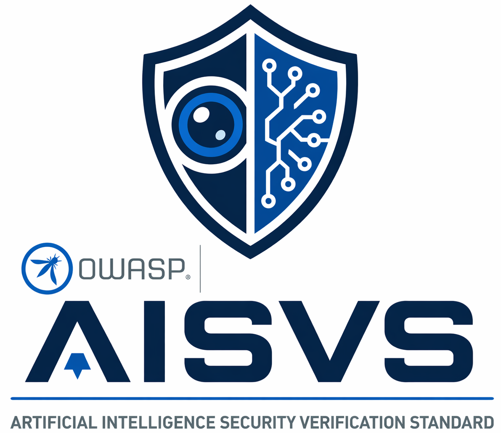

<p align="center">
  <picture>
    <source media="(prefers-color-scheme: dark)" srcset="images/aisvs-logo-dark.png">
    <source media="(prefers-color-scheme: light)" srcset="images/aisvs-logo-light.png">
    
  </picture>
</p>

# OWASP Artificial Intelligence Security Verification Standard (AISVS)

[![CC BY-SA 4.0][cc-by-sa-shield]][cc-by-sa]

この著作物は [Creative Commons Attribution-ShareAlike 4.0 International License][cc-by-sa] の下でライセンスされています。


[![CC BY-SA 4.0][cc-by-sa-image]][cc-by-sa]

[cc-by-sa]: http://creativecommons.org/licenses/by-sa/4.0/
[cc-by-sa-image]: https://licensebuttons.net/l/by-sa/4.0/88x31.png
[cc-by-sa-shield]: https://img.shields.io/badge/License-CC%20BY--SA%204.0-blue.svg

## What is AISVS?

The **Artificial Intelligence Security Verification Standard (AISVS)** is a community-driven catalogue of testable security requirements for AI-enabled systems. It gives developers, architects, security engineers, and auditors a structured framework to design, build, test, and verify the security of AI applications throughout their lifecycle, from data collection and model training to deployment, monitoring, and retirement.

AISVS is modeled after the [OWASP Application Security Verification Standard (ASVS)](https://owasp.org/www-project-application-security-verification-standard/) and follows the same philosophy: every requirement should be **verifiable, testable, and implementable**.

## プロジェクトリーダー

このプロジェクトは [Jim Manico](https://github.com/jmanico) によって設立されました。現在のプロジェクトリーダーは [Jim Manico](https://github.com/jmanico), [Otto Sulin](https://github.com/ottosulin), [Rico Komenda](https://github.com/RicoKomenda), [Russ Memisyazici](https://github.com/vtknightmare) です。

---

### What AISVS is NOT

* **Not a governance framework.** Governance is well-covered by [NIST AI RMF](https://www.nist.gov/artificial-intelligence/risk-management-framework), [ISO/IEC 42001](https://www.iso.org/standard/81230.html), and EU AI Act compliance guides.
* **Not a risk management framework.** AISVS provides the technical controls that risk frameworks point to, but does not define risk assessment methodology.
* **Not a tool recommendation list.** AISVS is vendor-neutral and does not endorse specific products or frameworks.

### How AISVS complements other standards

| Standard | Focus | AISVS relationship |
| --- | --- | --- |
| OWASP ASVS | Web application security | AISVS extends ASVS concepts to AI-specific threats |
| [OWASP Top 10 for LLMs](https://owasp.org/www-project-top-10-for-large-language-model-applications/) | Awareness of top LLM risks | AISVS provides the detailed controls to mitigate those risks |
| [OWASP Top 10 for Agentic Applications](https://genai.owasp.org/resource/owasp-top-10-for-agentic-applications-for-2026/) | Awareness of top agentic AI risks | AISVS provides the detailed controls to address agentic-specific threats |
| NIST AI RMF | AI risk governance | AISVS supplies the testable technical controls that AI RMF references |
| ISO/IEC 42001 | AI management systems | AISVS complements with implementation-level security verification |

---

## Latest Stable Version

The latest stable version is **AISVS 1.0**, which can be found:

| Format | Link |
| --- | --- |
| PDF | _(pending for 1.0 release)_ |
| HTML | _(pending for 1.0 release)_ |
| Markdown (source) | [Browse online](https://github.com/OWASP/AISVS/tree/main/1.0/en) |

---

## Verification Levels

Each AISVS requirement is assigned a verification level (1, 2, or 3) indicating the depth of security assurance:

| Level | Description | When to use |
| :---: | --- | --- |
| **1** | Essential baseline controls that every AI system should implement. | All AI applications, including internal tools and low-risk systems. |
| **2** | Standard controls for systems handling sensitive data or making consequential decisions. | Production systems, customer-facing AI, systems processing personal data. |
| **3** | Advanced controls for high-assurance environments requiring defense against sophisticated attacks. | Critical infrastructure, safety-critical AI, high-value targets, regulated industries. |

Organizations should select a target level based on the risk profile of their AI system. Most production systems should aim for at least Level 2.

## How to use AISVS

* **During design.** Use requirements as a security checklist when architecting AI systems.
* **During development.** Integrate requirements into CI/CD pipelines, code reviews, and testing.
* **During security assessments.** Use as a verification framework for penetration testing and audits.
* **For procurement.** Reference specific requirements when evaluating AI vendors and third-party models.

## Requirement Chapters

1. [トレーニングデータ完全性とトレーサビリティ (Training Data Integrity & Traceability)](1.0/ja/0x10-C01-Training-Data-Integrity-and-Traceability.md)
2. [入力バリデーション (Input Validation)](1.0/ja/0x10-C02-Input-Validation.md)
3. [モデルライフサイクル管理と変更管理 (Model Lifecycle Management & Change Control)](1.0/ja/0x10-C03-Model-Lifecycle-Management.md)
4. [インフラストラクチャ、構成、デプロイメントセキュリティ (Infrastructure, Configuration & Deployment Security)](1.0/ja/0x10-C04-Infrastructure.md)
5. [アクセス制御とアイデンティティ (Access Control & Identity)](1.0/ja/0x10-C05-Access-Control-and-Identity.md)
6. [モデル、フレームワーク、データのサプライチェーンセキュリティ (Supply Chain Security for Models, Frameworks & Data)](1.0/ja/0x10-C06-Supply-Chain.md)
7. [モデル動作、出力制御、安全保証 (Model Behavior, Output Control & Safety Assurance)](1.0/ja/0x10-C07-Model-Behavior.md)
8. [メモリ、エンベディング、ベクトルデータベースセキュリティ (Memory, Embeddings & Vector Database Security)](1.0/ja/0x10-C08-Memory-Embeddings-and-Vector-Database.md)
9. [自律オーケストレーションとエージェントアクションセキュリティ (Autonomous Orchestration & Agentic Action Security)](1.0/ja/0x10-C09-Orchestration-and-Agentic-Action.md)
10. [モデルコンテキストプロトコル (MCP) セキュリティ (Model Context Protocol (MCP) Security)](1.0/ja/0x10-C10-MCP-Security.md)
11. [敵対的堅牢性と攻撃耐性 (Adversarial Robustness & Attack Resistance)](1.0/ja/0x10-C11-Adversarial-Robustness.md)
12. [プライバシー保護と個人データ管理 (Privacy Protection & Personal Data Management)](1.0/ja/0x10-C12-Privacy.md)
13. [監視、ログ記録、異常検出 (Monitoring, Logging & Anomaly Detection)](1.0/ja/0x10-C13-Monitoring-and-Logging.md)
14. [人間による監視と信頼 (Human Oversight and Trust)](1.0/ja/0x10-C14-Human-Oversight.md)

## Appendices

* [Appendix A: Glossary](https://github.com/OWASP/AISVS/blob/main/1.0/en/0x90-Appendix-A_Glossary.md)
* [Appendix B: References](https://github.com/OWASP/AISVS/blob/main/1.0/en/0x91-Appendix-B_References.md)
* [Appendix C: AI-Assisted Secure Coding](https://github.com/OWASP/AISVS/blob/main/1.0/en/0x92-Appendix-C_AI_for_Code_Generation.md)
* [Appendix D: AI Security Controls Inventory](https://github.com/OWASP/AISVS/blob/main/1.0/en/0x93-Appendix-D_AI_Security_Controls_Inventory.md)

---

## How to Reference AISVS Requirements

Each requirement has an identifier in the format `C<chapter>.<section>.<requirement>`, where each element is a number, for example `C9.4.3`.

- The `C<chapter>` value corresponds to the chapter from which the requirement comes; for example, all `C9.#.#` requirements are from the 'Autonomous Orchestration & Agentic Action Security' chapter.
- The `<section>` value corresponds to the section within that chapter where the requirement appears; for example, all `C9.4.#` requirements are in the 'Identity & Audit' section.
- The `<requirement>` value identifies the specific requirement within the chapter and section; for example, `C9.4.3` which as of version 1.0 of this standard is:

> Verify that audit logs are tamper-evident via append-only/WORM/immutable log store, cryptographic hash chaining where each record includes the hash of the prior record, or equivalent integrity guarantees that can be independently verified.

Since identifiers may change between versions of the standard, it is preferable for other documents, reports, or tools to use the following format: `v<version>-C<chapter>.<section>.<requirement>`, where 'version' is the AISVS version tag. For example: `v1.0-C9.4.3`.

Note: The `v` preceding the version number should always be lowercase.

If identifiers are used without including the `v<version>` element they should be assumed to refer to the latest AISVS content. As the standard grows and changes this becomes problematic, which is why writers or developers should include the version element.

---

## Versioning

Each stable release of AISVS is published as a numbered folder in this repository. Once a version is released its folder is locked; all future work happens in a new folder. This mirrors the approach used by [OWASP ASVS](https://github.com/OWASP/ASVS).

```text
/
├── 1.0/        <- current stable release (locked after release)
├── 1.01-dev/   <- next minor release (pending)
```

---

## Contributing

We welcome contributions from the community. Please [open an issue](https://github.com/OWASP/AISVS/issues) to report bugs or suggest improvements. We may ask you to [submit a pull request](https://github.com/OWASP/AISVS/pulls) based on the discussion.

To report a security issue with the AISVS project itself, please follow the [Security Policy](https://github.com/OWASP/AISVS/blob/main/Security.md).

## ライセンス

本プロジェクトのすべてのコンテンツは **[Creative Commons Attribution-Share Alike v4.0](https://creativecommons.org/licenses/by-sa/4.0/)** ライセンスの下にあります。
